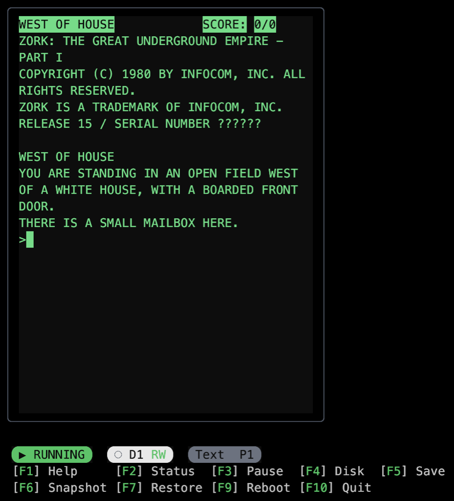
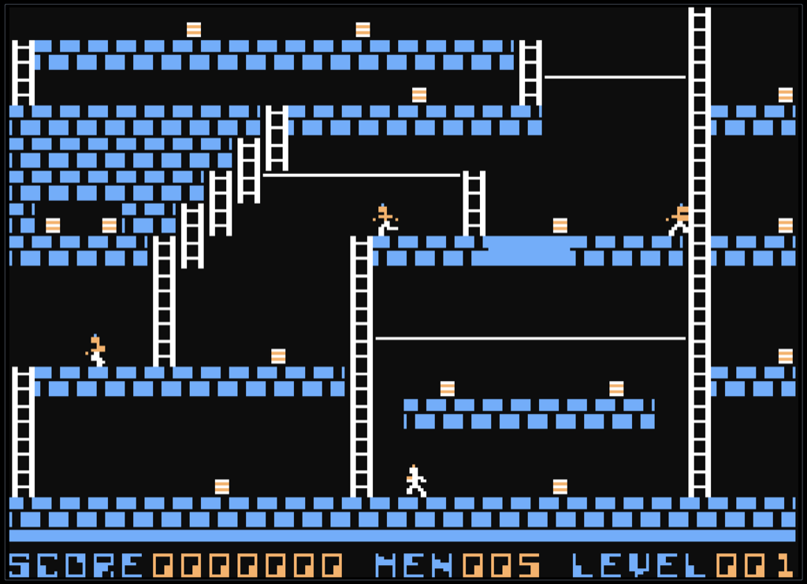

# Snapple ][

[](https://opensource.org/licenses/MIT)

A cycle-accurate Apple II Plus emulator for the terminal, built with TypeScript and React Ink.

> **Status**: v1.0 - Text mode, graphics modes (lo-res/hi-res), and Disk II controller complete. Boots to Applesoft BASIC and runs disk-based software.

## Features

- **Cycle-accurate emulation** - Built on [cpu6502](https://github.com/cameronbrodeur/cpu6502), a cycle-accurate 6502 emulator
- **Authentic timing** - Runs at 1.023 MHz, the original Apple II speed
- **Full display support**:
  - Text mode (40×24 characters with inverse/flash)
  - Lo-res graphics (40×48, 16 colors via Unicode half-blocks)
  - Hi-res graphics (280×192, 6-color NTSC artifact coloring)
  - Mixed mode support (graphics + 4-row text footer)
- **Disk II controller** - Load .woz, .dsk, .do, .po, disk images with full read/write support
- **Language Card** - 16KB RAM expansion for Integer BASIC support
- **Paddle/Joystick** - Keyboard-based game controller emulation
- **Save states** - Quick snapshot/restore with F6/F7 keys
- **Performance profiling** - Real-time CPU speed and memory metrics via F2 status bar
- **Beautiful terminal UI** - Built with React Ink for a responsive, modern CLI experience

## Screenshots

Classic games running in Snapple ][

| Zork I (Infocom, 1980) | Lode Runner (Brøderbund, 1983) |
|:----------------------:|:------------------------------:|
|  |  |
| *Text adventure in 40×24 mode* | *Hi-res graphics with NTSC artifact colors* |

## Installation

### From Source (Development)

```bash
# Clone the repository
git clone https://github.com/cameronbrodeur/snapple2.git
cd snapple2

# Install dependencies (cpu6502 is fetched automatically from GitHub)
npm install

# Build
npm run build

# Run
npm start
```

## ROM Files

**Important**: This emulator requires Apple II ROM files, which are copyrighted by Apple Inc. We do not distribute ROM files with this project.

You'll need **7 ROM files** (all 2KB each):

**Applesoft BASIC** (5 files = 10KB total):
- `applesoft-d000.bin` (2KB) - ROM 1, $D000-$D7FF
- `applesoft-d800.bin` (2KB) - ROM 2, $D800-$DFFF
- `applesoft-e000.bin` (2KB) - ROM 3, $E000-$E7FF
- `applesoft-e800.bin` (2KB) - ROM 4, $E800-$EFFF
- `applesoft-f000.bin` (2KB) - ROM 5, $F000-$F7FF

**System ROMs**:
- `monitor-f800.bin` (2KB) - Autostart Monitor, $F800-$FFFF
- `character-rom.bin` (2KB) - Character Generator

**Note**: ROMs are split to match the physical Apple II+ ROM chip organization (2716 EPROMs).

### ROM Search Locations

Snapple searches for ROMs in this order:

1. **Environment variable**: `$SNAPPLE_ROMS_DIR`
2. **CLI argument**: `snapple --roms-dir <path>`
3. **Project directory**: `./roms/`
4. **User home directory**: `~/.snapple2/roms/`

### ROM Acquisition

ROM files can be obtained by:
- Extracting from an original Apple II system you own
- Dumping from legally-owned Apple II hardware
- Using open-source ROM alternatives (if available)

See [roms/README.md](roms/README.md) for detailed instructions.

## Usage

### Basic Usage

```bash
# Auto-discover ROMs from standard locations
npm start

# Load a disk image
npm start -- --disk1 dos33.dsk

# Specify ROM directory
npm start -- --roms-dir ~/my-apple-roms/

# Or use environment variable
export SNAPPLE_ROMS_DIR=~/my-apple-roms
npm start

# Advanced options
npm start -- --verify-roms             # Verify ROM files and exit
npm start -- --log-profile             # Log detailed profiler data to /tmp/
```

### Keyboard Controls

**Emulator Controls** (Function Keys ONLY):

| Key | Action |
|-----|--------|
| **F1** | Toggle help dialog |
| **F2** | Cycle status bar modes (Minimal → Full → Profiler → Hidden) |
| **F3** | Pause/Resume emulation |
| **F4** | Disk manager (load, eject, create, write-protect, archive.org browser) |
| **F5** | Save disk changes to file |
| **F6** | Snapshot (save state) |
| **F7** | Restore (load state) |
| **F9** | Reboot with confirmation |
| **F10** | Quit emulator |

**Apple II Keys** (ALL pass through to the emulated Apple II):

| Key | Apple II Code | Description |
|-----|---------------|-------------|
| A-Z, 0-9 | $C1-$DA, $B0-$B9 | Regular characters (uppercase, high bit set) |
| Space, symbols | $A0, etc. | All punctuation and symbols |
| Return | $8D | Carriage return (Ctrl+M) |
| Escape | $9B | Escape (Ctrl+[) |
| Arrows | $88, $8A, $8B, $95 | Left, Down, Up, Right |
| Backspace/Delete | $88 | Left arrow (Ctrl+H) |
| Tab | $89 | Tab (Ctrl+I) |
| **Ctrl+@** | **$83** | **BREAK/interrupt** - Use this instead of Ctrl+C! |
| **Ctrl+H** | **$88** | **Backspace** - NOT help (use F1 for help) |
| **Ctrl+letter** | **$81-$9A** | **Most Ctrl combinations pass through** |

**Paddle/Joystick Controls**:

| Key | Action |
|-----|--------|
| A/D or ←/→ | PDL0 horizontal (Left/Right) |
| W/S or ↑/↓ | PDL1 vertical (Up/Down) |
| Space | Pushbutton 0 (Open Apple) |
| Option/Alt | Pushbutton 1 (Solid Apple) |

> **Important**: ALL Ctrl+letter combinations (except Ctrl+C) pass through to the Apple II as proper control codes. Use function keys (F1-F10) for emulator controls to avoid conflicts with Apple II programs.

## Known Issues & Behaviors

### Terminal Limitations

| Issue | Description | Workaround |
|-------|-------------|------------|
| **Ctrl+C kills emulator** | Terminal intercepts SIGINT before it reaches the emulator | Use **Ctrl+@** for Apple II BREAK signal; use **F10** to quit cleanly |
| **Function keys not working** | Some terminals don't pass function key escape sequences | Use kitty, ghostty, and iTerm2; check terminal keyboard settings |
| **Minimum terminal size** | Requires at least 44×27 characters | Resize terminal window if "Terminal Too Small" error appears |

### Graphics & Performance

| Issue | Description | Status |
|-------|-------------|--------|
| **Memory pressure in hi-res mode** | Hi-res rendering creates ~30MB/sec of short-lived allocations | Mitigated with buffer pools and memoization; status bar shows memory usage |
| **2GB memory warning** | Long sessions may approach Node.js heap limit | Status bar warns at 2GB; restart emulator if memory becomes critical |

### Audio

| Issue | Description | Status |
|-------|-------------|--------|
| **No speaker audio** | Speaker toggle at $C030 is stubbed | Design complete, implementation pending |

### Disk Operations

| Issue | Description | Notes |
|-------|-------------|-------|
| **DSK-to-WOZ conversion** | DSK/DO/PO files are converted to WOZ format on load | Automatic; original file unchanged |
| **Write protection** | Some disk images may need write protection toggled | Use F4 disk manager to toggle |

### Startup Behavior

| Behavior | Description |
|----------|-------------|
| **Screen shows `@` symbols** | Normal - RAM initializes to zero, and character 0x00 displays as `@` |
| **Prompt takes ~1 second** | Normal - ROM needs ~500K-1M cycles to initialize and display `]` prompt |
| **Disk boot takes 1-5 seconds** | Normal - DOS 3.3 needs time to find sync bytes and load |

### Save State Limitations

| Limitation | Description |
|------------|-------------|
| **In-memory only** | Save states are not persisted to disk between sessions |
| **Disk state included** | Current disk contents and dirty tracks are preserved in snapshots |

## Architecture

Snapple ][ is built with modularity and extensibility in mind:

```
┌─────────────────────────────────────────────┐
│            Terminal Interface               │
│         (React Ink Components)              │
├─────────────────────────────────────────────┤
│                                             │
│  ┌──────────────────────────────────────┐   │
│  │         Emulator UI                  │   │
│  │  ┌────────────────────────────────┐  │   │
│  │  │   Screen Pane (40×24 / 280×96) │  │   │
│  │  │   Status Bar                   │  │   │
│  │  │   Dialogs (Help, Disk, etc.)   │  │   │
│  │  └────────────────────────────────┘  │   │
│  └──────────────┬───────────────────────┘   │
│                 │                           │
├─────────────────┼───────────────────────────┤
│              Apple2Machine                  │
│  ┌──────────────────────────────────────┐   │
│  │   cpu6502 Machine (6502 CPU Core)    │   │
│  ├──────────────────────────────────────┤   │
│  │  Memory Bus (64KB Address Space)     │   │
│  │  ├─ RAM (48KB)                       │   │
│  │  ├─ Language Card (16KB)             │   │
│  │  ├─ Soft Switches (I/O)              │   │
│  │  ├─ Disk II Controller (slot 6)      │   │
│  │  ├─ Applesoft ROM (10KB)             │   │
│  │  └─ Monitor ROM (2KB)                │   │
│  ├──────────────────────────────────────┤   │
│  │  Video System (Text/LoRes/HiRes)     │   │
│  └──────────────────────────────────────┘   │
└─────────────────────────────────────────────┘
```

For detailed architecture documentation, see [agent-docs/architecture.md](agent-docs/architecture.md).

## Development

### Project Structure

```
snapple2/
├── src/
│   ├── cli.tsx                 # Entry point
│   ├── emulator/               # Core emulator
│   │   ├── apple2-machine.ts   # Main machine class
│   │   ├── constants.ts        # Memory map, timing
│   │   ├── save-state.ts       # Save/load state
│   │   └── types.ts
│   ├── memory/                 # Memory devices
│   │   ├── soft-switches.ts    # I/O soft switches
│   │   ├── language-card.ts    # 16KB RAM expansion
│   │   ├── keyboard-device.ts  # Keyboard with strobe
│   │   └── paddle-device.ts    # Game controller
│   ├── video/                  # Video system
│   │   ├── video-system.ts     # Video controller
│   │   ├── text-renderer.ts    # Text mode
│   │   ├── lores-renderer.ts   # Lo-res graphics
│   │   ├── hires-renderer.ts   # Hi-res graphics
│   │   └── hires-colors.ts     # NTSC artifact colors
│   ├── disk/                   # Disk II controller
│   │   ├── disk-controller.ts  # Main controller
│   │   ├── disk-drive.ts       # Drive mechanics
│   │   ├── disk-formats.ts     # DSK/NIB/WOZ support
│   │   └── woz-image.ts        # WOZ format handling
│   ├── rom/                    # ROM management
│   │   └── rom-manager.ts      # ROM loading
│   ├── ui/                     # Ink components
│   │   ├── emulator-app.tsx
│   │   ├── screen-pane.tsx
│   │   ├── status-bar.tsx
│   │   └── dialogs/            # Help, disk manager, etc.
│   ├── hooks/                  # React hooks
│   │   ├── use-emulator.ts
│   │   ├── use-keyboard.ts
│   │   └── use-execution.ts
│   └── utils/                  # Utility functions
│       ├── format.ts
│       ├── ascii.ts
│       └── profiler.ts
├── agent-docs/                 # Developer documentation
├── roms/                       # ROM files (gitignored)
└── README.md                   # This file
```

### Build Scripts

```bash
npm run build        # Compile TypeScript
npm run clean        # Remove dist/
npm start            # Run emulator
npm test             # Run tests
npm run format       # Format code with Prettier
npm run format:check # Check formatting
```

## Roadmap

### Completed

- [x] **Phase 1: Text Mode MVP** - Project setup, ROM loading, cpu6502 integration, text display, keyboard input, status bar, timing, save states
- [x] **Phase 2: Graphics Modes** - Lo-res (40×48), hi-res (280×192), mixed mode, NTSC artifact colors
- [x] **Phase 3: Disk II Controller** - WOZ1/2, DSK, NIB format support, read/write, motor simulation

### Planned

- [ ] **Phase 4: Speaker Audio** - Design complete, awaiting implementation
- [ ] **Phase 5: Additional Models** - Apple IIe (80-column, extended charset)

## Technical Details

### Timing

- **CPU Speed**: 1.023 MHz (authentic Apple II timing)
- **Frame Rate**: 60 fps
- **Cycles per Frame**: ~17,050 cycles

The emulator uses a high-resolution timer with drift compensation:
- `performance.now()` for sub-millisecond precision
- Accumulates timing debt across frames
- Maintains < 1% timing variance over extended runtime

### Display Rendering

| Mode | Resolution | Output |
|------|------------|--------|
| Text | 40×24 chars | 40×24 terminal cells |
| Lo-res | 40×48 pixels | 40×24 cells (Unicode ▀▄) |
| Hi-res | 280×192 pixels | 280×96 cells (Unicode half-blocks) |

### Memory Map

- **RAM**: 48KB ($0000-$BFFF)
- **I/O**: 256 bytes ($C000-$C0FF) - Soft switches
- **Peripheral ROM**: $C100-$CFFF - Slot ROMs including Disk II at $C600
- **ROM/Language Card**: 12KB ($D000-$FFFF)
  - Applesoft BASIC: 10KB ($D000-$F7FF)
  - Monitor: 2KB ($F800-$FFFF)

## Contributing

Contributions are welcome! This is a personal learning project, but if you'd like to contribute:

1. Fork the repository
2. Create a feature branch
3. Make your changes
4. Submit a pull request

Please ensure:
- Code follows TypeScript strict mode
- Changes are well-documented
- Commits follow [Conventional Commits](https://www.conventionalcommits.org/)

## Related Projects

- [cpu6502](https://github.com/cameronbrodeur/cpu6502) - The 6502 CPU core powering this emulator
- [AppleWin](https://github.com/AppleWin/AppleWin) - Windows Apple II emulator (reference implementation)
- [apple2js](https://github.com/whscullin/apple2js) - JavaScript Apple II emulator
- [apple2ts](https://github.com/ct6502/apple2ts) - TypeScript Apple II emulator (reference for disk implementation)

## Acknowledgments

- The cpu6502 library is built on the foundation of extensive 6502 documentation from [6502.org](http://www.6502.org/)
- Apple II architecture reference from [Understanding the Apple II](https://archive.org/details/understanding_the_apple_ii) by Jim Sather
- Inspired by the excellent work of the Apple II preservation community

## License

MIT License - See [LICENSE](LICENSE) file for details.

**Note**: ROM files are copyrighted by Apple Inc. and are not included with this project. Users must provide their own legally-obtained ROM files.

---

Built with TypeScript and React Ink. Powered by [cpu6502](https://github.com/cameronbrodeur/cpu6502).
